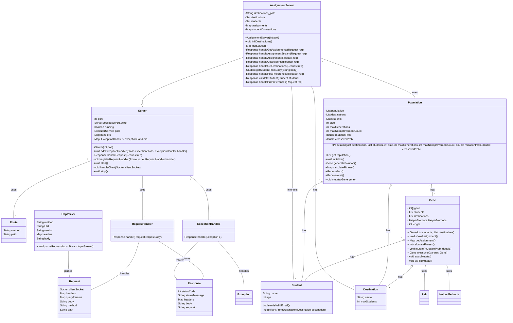

# Authors

- Yusif Askari: Server code implementation
- Ismayil Abdullazada: Genetic algorithm development
- Murad Ganbarli: Client-side coding
- Saleh Alizada: GUI design



# Assignment Server

The **Assignment Server** is a robust server application designed to manage student assignments. It provides a variety of endpoints to handle tasks such as retrieving a list of destinations, fetching assignments, managing student preferences, and subscribing to real-time updates.

## Architecture

The server is built on a multi-threaded architecture, utilizing a `ServerSocket` to listen for incoming connections. Each connection is handled by a separate thread from a thread pool, ensuring efficient resource utilization.

The server uses an `HttpParser` to parse incoming HTTP requests and a map of routes to handlers to process the requests. The assignment of students to destinations is carried out using a `GeneticAlgorithm`, taking into account their preferences.

The server also supports Server-Sent Events (SSE) for real-time updates. Clients can subscribe to the `/assignment-stream` endpoint to receive updates whenever there is a change in the assignments.

## Running the Server

### Using the Pre-Built JAR

#### Prerequisites

- Java 21 or higher

1. Open a terminal in the project root directory.
2. Run the following command to start the server:

   ```bash
   java -jar server.jar
   ```

### Using Gradle Wrapper

The Gradle Wrapper is included in the project and can be used to build and run the server without needing to install Gradle.

1. Open a terminal in the project root directory.
2. Run the following command to start the server:

   ```bash
   ./gradlew run
   ```

   If you're on Windows, use `gradlew.bat run` instead of `./gradlew run`.

### Using Docker

You can also run the server using Docker. The Docker image for the server is available on Docker Hub. You can pull the image and run it with the following commands:

```bash
docker pull solodriven/final_project_server
docker run -p 8080:8080 solodriven/final_project_server
```

## Endpoints

- **`GET /destinations`**: This endpoint retrieves a list of all available destinations. It doesn't require any input and returns a JSON array of cities.

- **`POST /preferences`**: This endpoint creates a new student with their preferred cities. It accepts a JSON body with an `email` field and a `preferences` field, which is an array of strings representing the student's preferred cities. If the student is successfully created, it returns a 201 status code with a message indicating the student was created. If the student already exists or there's an error with the input, it returns an appropriate error message and status code.

- **`PUT /preferences`**: This endpoint updates a student's preferred cities. It accepts a JSON body with an `email` field and a `preferences` field, which is an array of strings representing the student's new preferred cities. If the student's preferences are successfully updated, it returns a 200 status code with a message indicating the student was updated. If the student doesn't exist or there's an error with the input, it returns an appropriate error message and status code.

- **`GET /students`**: This endpoint retrieves a list of all students. It doesn't require any input and returns a JSON array of student objects, each with an `email` field and a `preferences` field.

- **`POST /assign`**: This endpoint assigns a student to a destination based on their preferences and the current assignments. It accepts a JSON body with an `email` field and a `preferences` field. If the student doesn't exist or there's an error with the input, it returns an appropriate error message and status code. If the assignment is successful, it returns a JSON object with the new assignment for the student who requested it.

- **`GET /assignments`**: This endpoint retrieves all the assignments. It doesn't require any input and returns a JSON object representing all the assignments. Each key in the object is a student's email and the corresponding value is the city they've been assigned to.

- **`GET /assignment-stream`**: This endpoint subscribes a student to updates on the assignments. It requires a `clientId` query parameter, which should be the email of the student subscribing to the updates. It doesn't return a traditional response. Instead, it keeps the connection open and sends updates in the form of server-sent events whenever there's a change in the assignments. If the `clientId` isn't provided or the student doesn't exist, it returns an appropriate error message and status code.

## Server-Sent Events (SSE)

Server-Sent Events (SSE) is a standard that allows a web server to push updates to the client. Unlike WebSockets, SSE is a one-way communication channel from the server to the client. In this application, SSE is used to push assignment updates to the clients in real-time.

## Dependencies

- **Gson**: Utilized for converting Java objects to JSON and vice versa.

# Run App

`pip3 install tkinter`

`python3 app.py`
